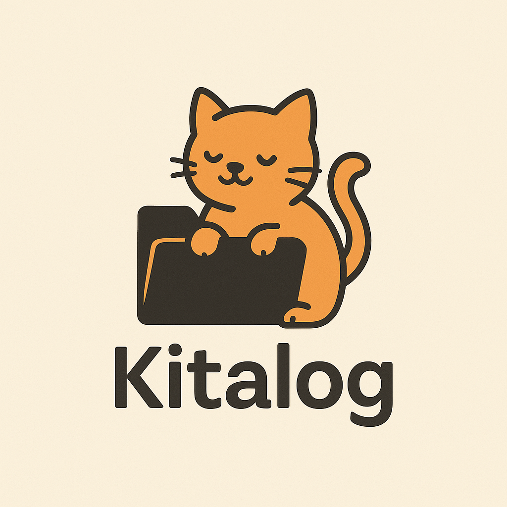

# Kitalog

**Kitalog** is a LAN-based web application that makes it effortless to share files, images, links, and plain text messages with anyone on the same local network regardless of their OS. It’s like iMessage meets AirDrop — all in your browser, with no installs[^1], logins, or cloud dependency.

## 🌟 Features

- **Instant sharing** via drag-and-drop, paste, or message input
- **Supports** files, images, text, and links
- **Live updates** with no page reloads
- **Clickable link icons** for easy re-sharing of any item
- **Works offline on LAN** — no internet connection needed
- **iOS Shortcut support** for native-feeling share sheet integration
- **Filesystem persistence** — content survives restarts

## 🔧 Status

Kitalog is currently in active development. The [MVP requirements](mvp-requirements.md) define the current feature scope and priorities.

## 🐾 Why “Kitalog”?

It’s a friendly mashup of “catalog” and “kitten,” because why not? This app is meant to feel warm, low-friction, and useful — a digital drop zone for home, work, or anything in between.

## 💡 Future Goals

- Browser notifications
- Link previews and file metadata
- File browser view and search
- Optional mobile app integration via Capacitor

Stay tuned and feel free to watch/star the repo for updates!

---

[^1]: Except for the backend, which must be hosted on the network, either as a process or a container.
